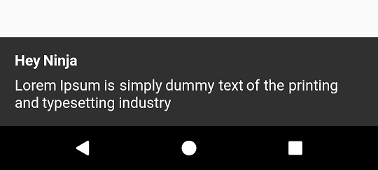
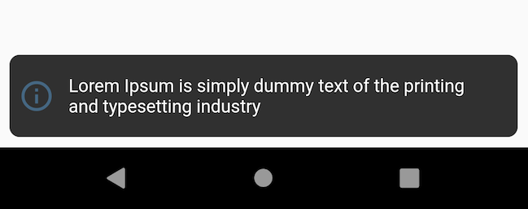
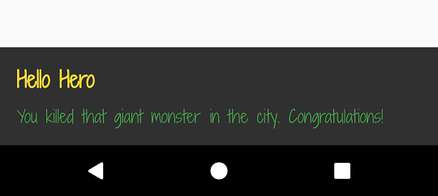
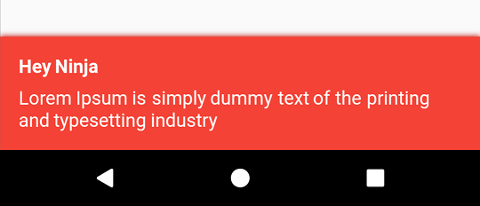
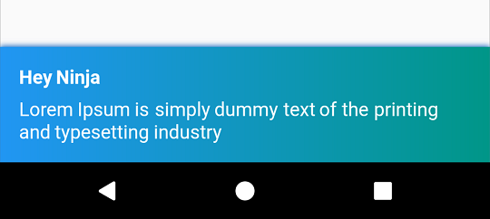
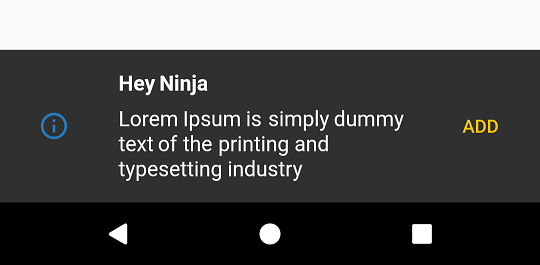
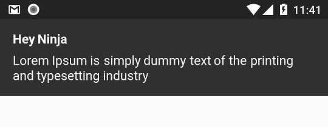
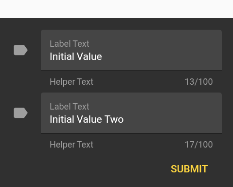

# Flushbar

Use this package if you need more customization when notifying your user. For Android developers, it is made to substitute
toasts and snackbars. IOS developers, I don't know what you use there, but you will like it.

See the [install instructions](https://pub.dartlang.org/packages/flushbar#-installing-tab-).

## Quick reference

Since customization requires a lot of properties, here is a quick cheatsheet:

Property | What does it do
-------- | ---------------
title    | The title displayed to the user
message  | The message displayed to the user.
titleText | Replaces [title]. Although this accepts a [widget], **it is meant to receive [Text] or [RichText]**
messageText | Replaces [message]. Although this accepts a [widget], **it is meant to receive [Text] or  [RichText]**
icon | You can use any widget here, but I recommend [Icon] or [Image] as indication of what kind of message you are displaying. Other widgets may break the layout
shouldIconPulse | An option to animate the icon (if present). Defaults to true.
maxWidth | Used to limit Flushbar width (usually on large screens)
margin | Adds a custom margin to Flushbar
padding | Adds a custom padding to Flushbar. The default follows material design guide line
borderRadius | Adds a radius to all corners of Flushbar. Best combined with [margin]. I do not recommend using it with [showProgressIndicator] or [leftBarIndicatorColor]
borderColor | Adds a border to every side of Flushbar. I do not recommend using it with [showProgressIndicator] or [leftBarIndicatorColor]
borderWidth | Changes the width of the border if [borderColor] is specified
backgroundColor | Flushbar background color. Will be ignored if [backgroundGradient] is not null.
leftBarIndicatorColor | If not null, shows a left vertical bar to better indicate the humor of the notification. It is not possible to use it with a [Form] and I do not recommend using it with [LinearProgressIndicator].
boxShadows | The shadows generated by Flushbar. Leave it null if you don't want a shadow. You can use more than one if you feel the need. Check [this example](https://github.com/flutter/flutter/blob/master/packages/flutter/lib/src/material/shadows.dart)
backgroundGradient | Flushbar background gradient. Makes [backgroundColor] be ignored.
mainButton | A [FlatButton] widget if you need an action from the user.
onTap | A callback that registers the user's click anywhere. An alternative to [mainButton]
duration | How long until Flushbar will hide itself (be dismissed). To make it indefinite, leave it null.
isDismissible | Determines if the user can swipe or click the overlay (if [routeBlur] > 0) to dismiss. It is recommended that you set [duration] != null if this is false. If the user swipes to dismiss or clicks the overlay, no value will be returned.
dismissDirection | FlushbarDismissDirection.VERTICAL by default. Can also be [FlushbarDismissDirection.HORIZONTAL] in which case both left and right dismiss are allowed.
flushbarPosition | Flushbar can be based on [FlushbarPosition.TOP] or on [FlushbarPosition.BOTTOM] of your screen. [FlushbarPosition.BOTTOM] is the default.
flushbarStyle | Flushbar can be floating or be grounded to the edge of the screen. If grounded, I do not recommend using [margin] or [borderRadius]. [FlushbarStyle.FLOATING] is the default
forwardAnimationCurve | The [Curve] animation used when show() is called. [Curves.easeOut] is default.
reverseAnimationCurve | The [Curve] animation used when dismiss() is called. [Curves.fastOutSlowIn] is default.
animationDuration | Use it to speed up or slow down the animation duration
showProgressIndicator | true if you want to show a [LinearProgressIndicator]. If [progressIndicatorController] is null, an infinite progress indicator will be shown
progressIndicatorController | An optional [AnimationController] when you want to control the progress of your [LinearProgressIndicator]. You are responsible for controlling the progress
progressIndicatorBackgroundColor | a [LinearProgressIndicator] configuration parameter.
progressIndicatorValueColor | a [LinearProgressIndicator] configuration parameter.
barBlur | Default is 0.0. If different than 0.0, blurs only Flushbar's background. To take effect, make sure your [backgroundColor] has some opacity. The greater the value, the greater the blur.
blockBackgroundInteraction | Determines if user can interact with the screen behind it. If this is false, [routeBlur] and [routeColor] will be ignored
routeBlur | Default is 0.0. If different than 0.0, creates a blurred overlay that prevents the user from interacting with the screen. The greater the value, the greater the blur. It does not take effect if [blockBackgroundInteraction] is false
routeColor | Default is [Colors.transparent]. Only takes effect if [routeBlur] > 0.0. Make sure you use a color with transparency e.g. `Colors.grey[600].withOpacity(0.2)`. It does not take effect if [blockBackgroundInteraction] is false
userInputForm | A [TextFormField] in case you want a simple user input. Every other widget is ignored if this is not null.
onStatusChanged | a callback for you to listen to the different Flushbar status

#### Quick tip

If you use a lot of those properties, it makes sense to make a factory to help with  your Flushbar's base appearance.
Things like shadows, padding, margins, text styles usually don't change within the app. Take a look at FlushbarHelper class and use it as an example.

## We are on YouTube!

While studying Flutter I stumbled on two amazing tutorials on how to use Flushbar.
Make sure you show those guys some love.
1. A beginners [tutorial](https://www.youtube.com/watch?v=KNpxyyA8MDA) by **Matej Rešetár**
2. A more [advanced usage](https://www.youtube.com/watch?v=FRCvqkyeCzQ) by **Javier González Rodríguez**

## Getting Started

The examples bellow were updated for version 1.3.0. Changes might have been made. See the [changelog](CHANGELOG.md) if any of the examples do not
reflect Flushbar's current state.

### The possibilities


### A basic Flushbar

The most basic Flushbar uses only a message. Failing to provide it before you call `show()` will result in a runtime error.
`Duration`, if not provided, will create an infinite Flushbar, only dismissible by code, back button clicks, or a drag (case `isDismissible` is set to `true`).

- Note that only `message` is a required parameter. All the other ones are optional

```dart
class YourAwesomeApp extends StatelessWidget {

  @override
  Widget build(BuildContext context) {
    return MaterialApp(
      title: 'YourAwesomeApp',
      home: Scaffold(
        Container(
          child: Center(
            child: MaterialButton(
              onPressed: (){
                Flushbar(
                  title:  "Hey Ninja",
                  message:  "Lorem Ipsum is simply dummy text of the printing and typesetting industry",
                  duration:  Duration(seconds: 3),              
                )..show(context);
              },
            ),
          ),
        ),
      ),
    );
  }
}
```



### Lets get crazy Flushbar

Here is how customized things can get.

```dart
Flushbar(
      title: "Hey Ninja",
      message: "Lorem Ipsum is simply dummy text of the printing and typesetting industry",
      flushbarPosition: FlushbarPosition.TOP,
      flushbarStyle: FlushbarStyle.FLOATING,
      reverseAnimationCurve: Curves.decelerate,
      forwardAnimationCurve: Curves.elasticOut,
      backgroundColor: Colors.red,
      boxShadows: [BoxShadow(color: Colors.blue[800], offset: Offset(0.0, 2.0), blurRadius: 3.0)],
      backgroundGradient: LinearGradient(colors: [Colors.blueGrey, Colors.black]),
      isDismissible: false,
      duration: Duration(seconds: 4),
      icon: Icon(
        Icons.check,
        color: Colors.greenAccent,
      ),
      mainButton: FlatButton(
        onPressed: () {},
        child: Text(
          "CLAP",
          style: TextStyle(color: Colors.amber),
        ),
      ),
      showProgressIndicator: true,
      progressIndicatorBackgroundColor: Colors.blueGrey,
      titleText: Text(
        "Hello Hero",
        style: TextStyle(
            fontWeight: FontWeight.bold, fontSize: 20.0, color: Colors.yellow[600], fontFamily: "ShadowsIntoLightTwo"),
      ),
      messageText: Text(
        "You killed that giant monster in the city. Congratulations!",
        style: TextStyle(fontSize: 18.0, color: Colors.green, fontFamily: "ShadowsIntoLightTwo"),
      ),
    );
```


- Don't forget to call `show()` or the bar will stay hidden.
- To deactivate any of those properties, pass `null` to it.

### Styles
Flushbar can be either floating or grounded to the edge of the screen.
I don't recommend using `margin` or `borderRadius` if you chose `FlushbarStyle.GROUNDED` style.

```dart
Flushbar(flushbarStyle: FlushbarStyle.FLOATING)
```
or
```dart
Flushbar(flushbarStyle: FlushbarStyle.GROUNDED)
```
Floating Style            |  Grounded Style
:------------------------------------------------------:|:-------------------------------------------------------:
  |   

### Padding and Border Radius
You can give it some padding and a border radius. Works best with `FlushbarStyle.FLOATING`

```dart
Flushbar(
  margin: EdgeInsets.all(8),
  borderRadius: 8,
);
  
```


### Left indicator bar

Flushbar has a lateral bar to better convey the humor of the notification. To use it, simple give `leftBarIndicatorColor` a color.

```dart
Flushbar(
  message: "Lorem Ipsum is simply dummy text of the printing and typesetting industry",
  icon: Icon(
    Icons.info_outline,
    size: 28.0,
    color: Colors.blue[300],
    ),
  duration: Duration(seconds: 3),
  leftBarIndicatorColor: Colors.blue[300],
)..show(context);
```


### Customize your text

If you need a more fancy text, you can use [Text](https://docs.flutter.io/flutter/widgets/Text-class.html) or [RichText](https://api.flutter.dev/flutter/widgets/RichText-class.html)
and pass it to the `titleText` or `messageText` variables.

- Note that `title` will be ignored if `titleText` is not `null`
- Note that `message` will be ignored if `messageText` is not `null`

```dart
Flushbar(
  title: "Hey Ninja", //ignored since titleText != null
  message: "Lorem Ipsum is simply dummy text of the printing and typesetting industry", //ignored since messageText != null
  titleText: Text("Hello Hero", style: TextStyle(fontWeight: FontWeight.bold, fontSize: 20.0 color: Colors.yellow[600], fontFamily:"ShadowsIntoLightTwo"),),
  messageText: Text("You killed that giant monster in the city. Congratulations!", style: TextStyle(fontSize: 16.0, color: Colors.green[fontFamily: "ShadowsIntoLightTwo"),),
)..show(context);
```



### Customize background and shadow

You can paint the background with any color you want. You can use any shadow you want.
Just give it a `backgroundColor` and `boxShadows`.

```dart
Flushbar(
  title: "Hey Ninja",
  message: "Lorem Ipsum is simply dummy text of the printing and typesetting industry",
  backgroundColor: Colors.red,
  boxShadows: [BoxShadow(color: Colors.red[800], offset: Offset(0.0, 2.0), blurRadius: 3.0,)],
)..show(context);
```



Want a gradient in the background? No problem.

- Note that `backgroundColor` will be ignored while `backgroundGradient` is not `null`

```dart
Flushbar(
  title: "Hey Ninja",
  message: "Lorem Ipsum is simply dummy text of the printing and typesetting industry",
  backgroundGradient: LinearGradient(colors: [Colors.blue, Colors.teal]),
  backgroundColor: Colors.red,
  boxShadows: [BoxShadow(color: Colors.blue[800], offset: Offset(0.0, 2.0), blurRadius: 3.0,)],
)..show(context);
```



### Icon and button action

Let us put a Icon that has a `PulseAnimation`. Icons have this animation by default and cannot be changed as of now.
Also, let us put a button. Have you noticed that `show()` returns a `Future`?
This Future will yield a value when you call `dismiss([T result])`.
I recommend that you specify the `result` generic type if you intend to collect an user input.

```dart
Flushbar flush;
bool _wasButtonClicked;
```

```dart
@override
  Widget build(BuildContext context) {
    return Container(
      child: Center(
        child: MaterialButton(
          onPressed: () {
            flush = Flushbar<bool>(
              title: "Hey Ninja",
              message: "Lorem Ipsum is simply dummy text of the printing and typesetting industry",
              icon: Icon(
                       Icons.info_outline,
                       color: Colors.blue,),
              mainButton: FlatButton(
                             onPressed: () {
                                 flush.dismiss(true); // result = true
                               },
                             child: Text(
                               "ADD",
                               style: TextStyle(color: Colors.amber),
                             ),
                           ),) // <bool> is the type of the result passed to dismiss() and collected by show().then((result){})
              ..show(context).then((result) {
                setState(() { // setState() is optional here
                  _wasButtonClicked = result;
                });
              });
          },
        ),
      ),
    );
  }
```



### Flushbar position

Flushbar can be at `FlushbarPosition.BOTTOM` or `FlushbarPosition.TOP`.

```dart
Flushbar(
  flushbarPosition: FlushbarPosition.TOP,
  title: "Hey Ninja",
  message: "Lorem Ipsum is simply dummy text of the printing and typesetting industry",)..show(context);
```



### Duration and dismiss policy

By default, Flushbar is infinite. To set a duration, use the `duration` property.
By default, Flushbar is dismissible by the user. A right or left drag will dismiss it.
Set `isDismissible` to `false` to change this behaviour.

```dart
Flushbar(
  title: "Hey Ninja",
  message: "Lorem Ipsum is simply dummy text of the printing and typesetting industry",
  duration: Duration(seconds: 3),
  isDismissible: false,
)..show(context);
```

### Progress Indicator

If you are loading something, use a [LinearProgressIndicator](https://docs.flutter.io/flutter/material/LinearProgressIndicator-class.html)
If you want an undetermined progress indicator, do not set `progressIndicatorController`.
If you want a determined progress indicator, you now have full control over the progress since you own the `AnimationController`

- There is no need to add a listener to your controller just to call `setState(){}`. Once you pass in your controller, `Flushbar` will do this automatically. Just make sure you call `_controller.forward()`

```dart

AnimationController _controller = AnimationController(
      vsync: this,
      duration: Duration(seconds: 3),
    );

Flushbar(
  title: "Hey Ninja",
  message: "Lorem Ipsum is simply dummy text of the printing and typesetting industry",
  showProgressIndicator: true,
  progressIndicatorController: _controller,
  progressIndicatorBackgroundColor: Colors.grey[800],
)..show(context);
```

### Show and dismiss animation curves

You can set custom animation curves using `forwardAnimationCurve` and `reverseAnimationCurve`.

```dart
Flushbar(
  forwardAnimationCurve: Curves.decelerate,
  reverseAnimationCurve: Curves.easeOut,
  title: "Hey Ninja",
  message: "Lorem Ipsum is simply dummy text of the printing and typesetting industry",
)..show(context);
```

### Listen to status updates

You can listen to status update using the `onStatusChanged` property.

- Note that when you pass a new listener using `onStatusChanged`, it will activate once immediately so you can check in what state the Flushbar is.

```dart

Flushbar flushbar = Flushbar(title: "Hey Ninja", message: "Lorem Ipsum is simply dummy text of the printing and typesetting industry");

  flushbar
    ..onStatusChanged = (FlushbarStatus status) {
      switch (status) {
        case FlushbarStatus.SHOWING:
          {
            doSomething();
            break;
          }
        case FlushbarStatus.IS_APPEARING:
          {
            doSomethingElse();
            break;
          }
        case FlushbarStatus.IS_HIDING:
          {
            doSomethingElse();
            break;
          }
        case FlushbarStatus.DISMISSED:
          {
            doSomethingElse();
            break;
          }
      }
    }
    ..show(context);

```

### Input text

Sometimes we just want a simple user input. Use the property`userInputForm`.

- Note that buttons, messages, and icons will be ignored if `userInputForm != null`
- `dismiss(result)` will yield result. `dismiss()` will yield null.

```dart
Flushbar<List<String>> flush;
final GlobalKey<FormState> _formKey = GlobalKey<FormState>();
```

```dart
TextFormField getFormField(String text) {
    return TextFormField(
      initialValue: text,
      style: TextStyle(color: Colors.white),
      maxLength: 100,
      maxLines: 1,
      maxLengthEnforced: true,
      decoration: InputDecoration(
          fillColor: Colors.white10,
          filled: true,
          icon: Icon(
            Icons.label,
            color: Colors.grey[500],
          ),
          border: UnderlineInputBorder(),
          helperText: "Helper Text",
          helperStyle: TextStyle(color: Colors.grey),
          labelText: "Label Text",
          labelStyle: TextStyle(color: Colors.grey)),
    );
  }

flush = Flushbar<List<String>>(
  userInputForm = Form(
          key: _formKey,
          child: Column(
            mainAxisSize: MainAxisSize.min,
            children: [
              getTextFormField("Initial Value"),
              getTextFormField("Initial Value Two"),
            ]
            Align(
              alignment: Alignment.bottomRight,
              child: Padding(
                padding: const EdgeInsets.only(top: 8.0),
                child: MaterialButton(
                  textColor: Colors.amberAccent,
                  child: Text("SUBMIT"),
                  onPressed: () {
                    flush.dismiss([_controller1.value.text, _controller2.value.text]);
                  },
                ),
              ),
            )
          ],),),
)..show(context).then((result) {
        if (result != null) {
          String userInput1 = result[0];
          String userInput2 = result[1];
        }
      });
```

This example tries to mimic the [Material Design style guide](https://material.io/design/components/text-fields.html#anatomy)



## Flushbar Helper

I made a helper class to facilitate the creation of the most common Flushbars.

```dart
FlushbarHelper.createSuccess({message, title, duration});
FlushbarHelper.createInformation({message, title, duration});
FlushbarHelper.createError({message, title, duration});
FlushbarHelper.createAction({message, title, duration flatButton});
FlushbarHelper.createLoading({message,linearProgressIndicator, title, duration, progressIndicatorController, progressIndicatorBackgroundColor});
FlushbarHelper.createInputFlushbar({textForm});
```

## Make it rain

<a href="https://www.buymeacoffee.com/AndreHaueisen" target="_blank"></a>